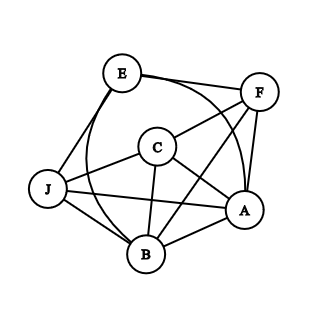

# Secret Santa

Ce repo contient la description et le développement du cas technique "secret santa" proposé par OuiHelp.

## Description

On est proche de Noël, nous sommes un groupe d'amis, dont certains sont en couple, et nous voulons organiser un "secret santa" (un échange de cadeaux entre les membres du groupe). Pour ce "secret santa" comme nous sommes un groupe exigeant notre répartition des cadeaux (le "qui donne à qui") doit répondre à 3 règles :

1. Chaque membre du groupe doit faire un et un seul cadeau, chaque membre du groupe doit recevoir un et un seul cadeau.
2. Il ne peut pas y avoir de réciprocité dans la répartition : si A offre à B, alors B ne peut pas offrir à A.
3. Il ne peut pas y avoir de cadeaux entre membres d'un couple : si A et B sont en couples, alors A n'offre pas à B et B n'offre pas à A.

Un jeux de données d'exemple, de test pour les membres et pour les couples :

    PEOPLE = ["Florent", "Jessica", "Coline", "Emilien", "Ambroise", "Bastien"]
    COUPLES = [("Florent", "Jessica"), ("Coline", "Emilien")]

Le but de l'exercice est d'écrire un "logiciel", qui calcule et retourne une répartition possible des cadeaux.

## Première solution: brute force search

Générer les différentes suites de membres possibles. Une suite de membres est valide si chaque membre du groupe apparaît une seule fois et si deux membres en couple ne sont pas adjacents dans la suite. Le premier et le dernier membre de la suite ne doivent pas être en couple non plus.

Par exemple, la représentation de la suite de membres par la liste python ["Florent", "Jessica", "Coline", "Ambroise", "Emilien", "Bastien"] indique que Florent offre un cadeau à Jessica, qui offre un cadeau à Coline, et ainsi de suite jusqu'à Bastien qui offre un cadeau à Florent. Cette solution n'est pas valide puisque Florent et Jessica sont en couple.
Une solution valide est ["Florent", "Coline", "Jesssica", "Ambroise", "Emilien", "Bastien"].

Complexité:
- temporelle: `O(!n)`
- mémoire: `O(n)` 

## Reformulation

Pour mieux visualiser le problème et les possibles cadeaux des uns envers les autres, il est possible de modéliser le problème sous forme de graphe:

- chaque sommet représente un membre du groupe
- chaque arête représente un possibilité de cadeau d'un membre à un autre

Par exemple, en utilisant le jeux de données d'exemple (chaque membre est désigné par l'intial de son prénom):



On obtient un graphe non dirigé, sans poids (*"undirected unweighted graph"*).

Avec cette représentation, le problème peut être reformuler comme suit:
> Trouver le chemin reliant chaque sommet exactement une fois et revenant au sommet de départ.

Ce problème correspond au problème du cycle ou circuit Hamiltonian ([Hamiltonian cycle problem](https://en.wikipedia.org/wiki/Hamiltonian_path_problem)). C'est un problème faisant partie de la classe des problèmes appélés *NP-complete*.

Cette classe de problème est par définition difficile à résoudre.

Quelques algorithmes et méthodes utilisés pour résoudre ce problème sont:

- Brute Force (`O(!n)`)
- Backtraking (`O(!n)`)
- Algorithme de Held-Karp (`O(n^2*2^n)`)

Se référer à la page Wikipédia citée au-dessus pour plus de détails.


## Comment lancer *secret-santa*

Nécessaire au lancement du programme: `Python 3.7+` 

Pour lancer *secret-santa* en utilisant l'algorithme par défaut `BRUTE FORCE SEARCH`:

```bash
python secret-santa.py data/data-test.json
```

Accéder aux différentes options:

```bash
python secret-santa.py --help
```

### Sources de données supportées

- Fichier au format `json` contenant un dictionnaire avec pour clés :
    - `"people"` (`List[str]`): liste des membres du groupes
    - `"couples"` (`List[List[str]]`): liste des couples 


### Algorithmes supportés

- `BRUTE FORCE SEARCH` (`0`)
- `BACKTRACKING`  (`1`)

Par exemple, pour utiliser l'algorithme de `backtracking`:

```bash
python secret-santa.py data/data-test.json --algo 1
```

## Développement

Créer un environnement virtuel python:

```bash
python -m venv env
```

Activé l'environnement:

- Sous *Linux* ou *MacOS*:
```bash
source env/bin/activate
```

- Sous *Windows*:
```ms-dos
.\env\Scripts\activate.bat
```

Installer les dépendances de dévéloppement et de test:

```bash
pip install -r requirements-dev.txt
```

Lancer la suite de tests:

```bash
pytest
```

Pour générer un nouveau jeu de données avec `n_people` et `n_couple`, modifier ces valeurs dans le script `generate-data.py` et lancer:


```bash
python generate-data.py
```


## Pistes d'améliorations

- Valider davantage les données d'entrées

- Améliorer les messages d'erreur

- Ajouter d'autres sources de données supportées

- Proposer différents formats de sorties

- Implémentation alternative: Restructurer le code de manière à ce qu'il soit davatange orienté objet

- Implémenter des algorithmes plus performants: 

     - Randomiser les solutions dans l'approche brute force
     - Voir article [Wikipédia](https://en.wikipedia.org/wiki/Hamiltonian_path_problem)

- Utiliser des méthodes non convientionnelles:

    - DNA computing
    - Quantum computing (Résolution du [Traveling Salesperson problem](https://docs.ocean.dwavesys.com/en/latest/docs_dnx/reference/algorithms/tsp.html) avec la technologie annealing développée par D-Wave)